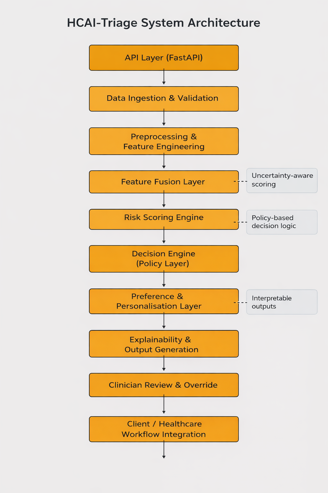

# 🩺 HCAI-Triage  
### Human-Centred AI System for Remote Primary Care & Early Warning

---

## 🚀 Overview

HCAI-Triage is a **production-oriented AI system prototype** designed to support remote healthcare triage and early risk detection.

The system focuses on **safe, interpretable, and human-centred decision-making**, enabling clinicians to make better-informed decisions while maintaining full control over outcomes.

It combines:
- structured risk scoring
- decision policy logic
- explainable outputs
- clinician-in-the-loop oversight

👉 This project demonstrates how AI can be embedded into **real-world clinical workflows**, not just used for isolated predictions.

---

## 🎯 Problem

Many existing triage systems:
- rely on static rule-based logic  
- lack uncertainty awareness  
- provide limited explainability  
- do not integrate well into clinician workflows  

This creates risks of:
- over-reliance on AI  
- poor interpretability  
- unsafe decision-making  

---

## 💡 Solution

HCAI-Triage addresses these issues through a **modular AI system architecture** that separates:

- risk estimation  
- decision-making  
- personalisation  
- explainability  
- human oversight  

This enables:
- safer recommendations  
- clearer reasoning  
- easier system maintenance  
- scalable deployment  

---

## 🏗️ System Architecture



The system is structured as a pipeline of modular components:

1. **API Layer (FastAPI)** – entry point for requests  
2. **Data Ingestion & Validation** – structured input handling  
3. **Preprocessing & Feature Engineering** – transforms raw data  
4. **Feature Fusion Layer** – combines multimodal signals  
5. **Risk Scoring Engine** – computes interpretable risk scores  
6. **Decision Engine (Policy Layer)** – maps risk to actions  
7. **Preference & Personalisation Layer** – adapts to user context  
8. **Explainability & Output Generation** – produces reasoning  
9. **Clinician Review & Override** – ensures human control  
10. **Client / Healthcare Integration** – supports real workflows  

---

## ⚙️ Key Features

- 🧠 **Interpretable Risk Scoring**  
  Structured scoring based on physiological signals, symptoms, and history  

- 📊 **Uncertainty-Aware Confidence**  
  Confidence estimation inspired by probabilistic reasoning  

- 🔁 **Policy-Based Decision Engine**  
  Clear mapping from risk → action (monitor, GP, urgent care)  

- 🧍‍♂️ **Human-Centred Design**  
  System designed around clinician support, not replacement  

- 🔎 **Explainable Outputs**  
  Natural language explanations tied to key contributing factors  

- 🩺 **Clinician-in-the-Loop Oversight**  
  Override mechanism ensures safe deployment  

---

## 📊 Example Prediction

### Request


### Response


The system:
- identifies key risk factors  
- computes a risk score and confidence  
- generates a recommendation  
- provides an explanation  
- ensures clinician review when required  

---

## 🔌 API Overview

### Endpoint

```
POST /predict
```

### Output includes:
- `risk_score`  
- `confidence`  
- `risk_level`  
- `recommendation`  
- `explanation`  
- `top_factors`  
- `clinician_review_required`  

---

## 🧪 Testing

The system includes test coverage for:
- API endpoints  
- high-risk and low-risk scenarios  
- clinician override logic  

Run tests with:

```bash
pytest
```

---

## ▶️ Running Locally

```bash
# create virtual environment
python -m venv .venv

# activate (Git Bash)
source .venv/Scripts/activate

# install dependencies
pip install -r requirements.txt

# run server
uvicorn api.main:app --host 127.0.0.1 --port 8001
```

Then open: http://127.0.0.1:8001/health

---

## 🛡️ Human-Centred AI Principles

This system is designed with:

- Safety first → escalation for high-risk cases
- Transparency → explainable outputs
- Human oversight → clinician override
- Trust calibration → confidence scoring
- User-centric design → preference-aware decisions

---

## 📄 Research Foundation

This project is based on a full Human-Centred AI system design and evaluation.

📘 Full report: [docs/report.pdf](docs/report.pdf)

---

## 🚀 Future Improvements

- integration with real ML models
- multimodal data pipelines (wearables, EHR)
- probabilistic calibration
- FHIR/NHS integration
- frontend clinician dashboard
- logging and observability

---

## 👤 Author

Oluwaseyi Bello
MSc Human-Centred Artificial Intelligence with Data Science
University of Exeter